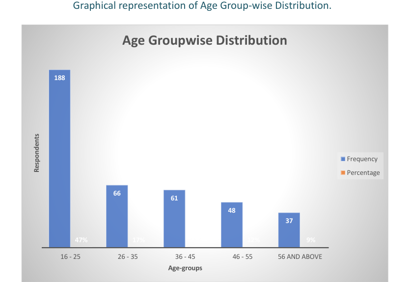

# 📊 Migration Analysis Project: Rural & Urban to Urban Migration in Amravati

This project explores the process and patterns of **internal migration** from both rural and urban regions to urban areas in Amravati, Maharashtra. Conducted as part of an M.Sc. Statistics program, the study is based on primary survey data collected from 400 respondents, with a focus on understanding migration reasons, demographic impacts, and future migration probabilities using advanced statistical analysis.

---

## 📄 Project Report

**👉 [Download Full Report (PDF)](./Migration_Analysis.pdf)**

---
### 👥 Age Distribution of Migrants

### 🎓 Reason for Migration

---

## 🧠 Objectives

- Examine gender-wise migration behavior
- Analyze associations between migration reasons and age/gender
- Model future migration probability using logistic regression
- Provide actionable insights on internal migration trends

---

## 🛠 Tech Stack

| Tool/Language | Purpose |
|---------------|---------|
| **SPSS**      | Descriptive stats, inferential testing |
| **R**         | Data manipulation, statistical testing |
| **Python**    | Data analysis, hypothesis testing, visualizations |
| **MS Excel**  | Data entry and preliminary charts |

---

## 📊 Statistical Methods Used

- Z-Test for proportion
- Chi-square tests for association
- ANOVA (Two-Factor)
- Logistic Regression Model
- Pearson Correlation

---

## 📈 Sample Findings

- **67%** of respondents were migrating for the first time.
- **Education (37.5%)** and **Employment (31.5%)** were the top reasons for migration.
- Significant association found between gender and reasons for migration.
- Logistic model predicted a **71% probability** of future migration among certain youth groups.
- **Economic opportunities** were the top driver for migration among males, while **marriage** was a major cause among females.
- **Younger age groups** were more likely to migrate for education or job prospects.
- Urban-origin migrants showed higher satisfaction and income than rural-origin ones.

---

## 📁 Files Included

- `Migration_Analysis.pdf` – Full report
- `README.md` – This summary file

---

## 👩‍💼 Author

**Vaibhavi Sanjay Kalmegh**  
📍 G.V.I.S.H., Amravati  
🎓 M.Sc. Statistics (2023)

---
